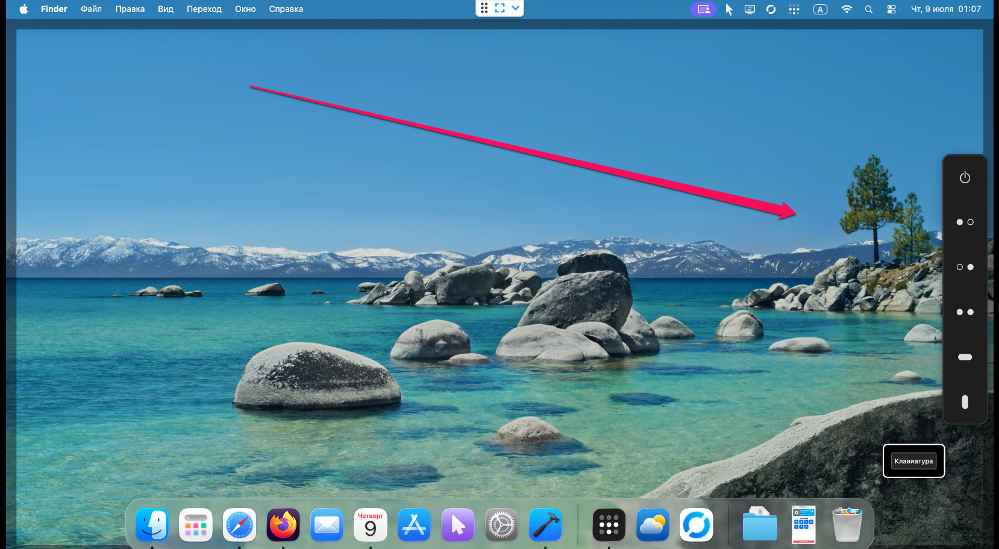

# AllyClicker

A native macOS **dwell-click** tool for head-tracker and other pointer-only users.

Move the cursor over a button on the floating panel, hold still for a moment — the
action arms; hold still over your target — it clicks. **No hands, no physical
buttons.** Built to replace the aging Windows *Point-N-Click* for a fully
paralyzed user.

Inspired by [Point-N-Click](https://polital.com/pnc/) by Polital Enterprises.



---

## Highlights

- 🖱️ **Dwell to click** — hold the cursor still to fire the armed action; a re-fire
  gate prevents machine-gun clicks, and brushing the panel cancels instantly.
- 🎛️ **Floating panel** — Left / Right / Double / Drag / Middle actions, dark
  native look, a sliding highlight, smooth collapse/expand animations.
- 🧲 **Hands-free everything** — collapse, move (drag the ON/OFF button with the
  Drag action), and configure the panel entirely by dwelling.
- 🔀 **Smart Middle** — over a link it middle-clicks (open in a new tab); over empty
  space it starts **auto-scroll**.
- 📜 **Auto-scroll** — drops an anchor where you stop; move away to scroll (farther =
  faster), tunable **intensity**; stop moving to left-click and exit.
- ⏱️ **Idle-disarm** — clears the armed action after a period of no movement (default
  2 min) so a later stray move can't fire.
- 🔧 **Full Settings window** — three tabs (Behavior / Panel / About), applied live.
- 🔊 **Audio feedback** — subtle system sounds on arm and click (toggleable).
- 🚀 **Launch at login** — via `SMAppService`.
- 🎨 **Native app icon**, menu-bar accessory (no Dock clutter).

---

## The panel

| Button | Action |
|--------|--------|
| ⏻ Show / hide | Collapse/expand the panel; also its move handle |
| Left click | Single left click |
| Right click | Single right click |
| Double click | Double left click |
| Drag | Press-move-release (select text, move files, drag the panel) |
| Middle / Scroll | Middle click over a link · auto-scroll over the page |

**Dwell flow:** stop over a button → it arms (red highlight). Move anywhere and stop
→ the action fires there. Brush the panel to cancel — no dwell needed.

**Move the panel hands-free:** arm **Drag**, then dwell the **ON/OFF** button — the
panel follows the cursor until you hold still to drop it. The position is remembered.

---

## Settings

Opened from the menu-bar icon. Changes apply on **Save**.

**Behavior**
- Dwell timings in 0.01 s steps: AutoMouse Delay (screen dwell), panel-button dwell,
  Drag press / release.
- Default to Left Click, Automatic Cancel.
- Idle-disarm (minutes; 0 = never).
- Cursor precision: jitter tolerance + move threshold (tune out head-tracker tremor).
- Auto-scroll intensity.
- Sound feedback on/off.
- Launch at login.

**Panel**
- Orientation: **vertical or horizontal** (horizontal docks top-center by default).
- Button editor: toggle each button on/off and reorder the active ones. ON/OFF is
  pinned first but can be removed (Settings stays reachable from the menu bar).
- Icon style **Custom / System** and icon size.
- Panel width and opacity.
- **Launch collapsed** (start showing only the ON/OFF button).

**About** — version, credits, project link.

---

## Requirements

- macOS 14+
- **Accessibility permission** (required to inject clicks):
  System Settings → Privacy & Security → Accessibility → enable AllyClicker.

### Operating the login screen

AllyClicker runs per-user and cannot appear on the macOS **login window**. To enter
your password hands-free there, use the built-in macOS features that *do* run
pre-login: **Pointer Control → Dwell** and the **Accessibility Keyboard**
(System Settings → Accessibility).

---

## Build & install

No Xcode project needed — the app is assembled with Command Line Tools.

```bash
git clone git@github.com:umkasanki/ally-clicker.git
cd ally-clicker

./App/setup-signing.sh   # once: stable self-signed identity (keeps the a11y grant)
./App/install.sh         # build + install to /Applications, then launch
```

`./App/build-app.sh` builds to `build/AllyClicker.app` without installing.
The pure core builds and tests cross-platform via SwiftPM: `swift test`.

### Install via Homebrew (own tap)

AllyClicker is distributed through a personal tap (it is self-signed, not
notarized, so pass `--no-quarantine`):

```bash
brew tap umkasanki/tap
brew install --cask --no-quarantine allyclicker
```

Then grant Accessibility (System Settings → Privacy & Security → Accessibility).
If macOS still blocks it: `xattr -dr com.apple.quarantine /Applications/AllyClicker.app`.

Maintainer: `./App/make-dmg.sh` builds `build/AllyClicker-<version>.dmg` and prints
its SHA-256; upload the DMG to a GitHub Release and update the cask in the tap. See
[packaging/homebrew/allyclicker.rb](packaging/homebrew/allyclicker.rb).

App icon: edit `tools/AppIcon.svg`, mirror it in `tools/make-icon.swift`, then
regenerate the `.icns` (see the `macos-app-icon` skill).

---

## Project structure

```
Sources/
  AllyClickerCore/   — pure logic (DwellEngine state machine, AutoScroll, Settings)
App/
  AllyClicker/       — macOS app (AppKit panel, SwiftUI settings, CGEvent injection)
  build-app.sh · install.sh · setup-signing.sh
Tests/
  AllyClickerTests/  — unit tests (dwell engine, settings, panel commands)
tools/               — app-icon SVG source + CoreGraphics generator
docs/                — spec, plan, session context
```

`AllyClickerCore` has no macOS UI dependencies and is fully unit-testable (it uses
its own `Point` type, not `CGPoint`, so it builds on Linux CI too).

---

## Credits

Inspired by **[Point-N-Click](https://polital.com/pnc/)** by Polital Enterprises — a Windows dwell-click tool.  
Action button icon style inspired by [DwellClick](https://github.com/pilotmoon/DwellClick) by Pilotmoon.  
Auto-scroll algorithm based on [LinearMouse](https://github.com/linearmouse/linearmouse) (MIT).
